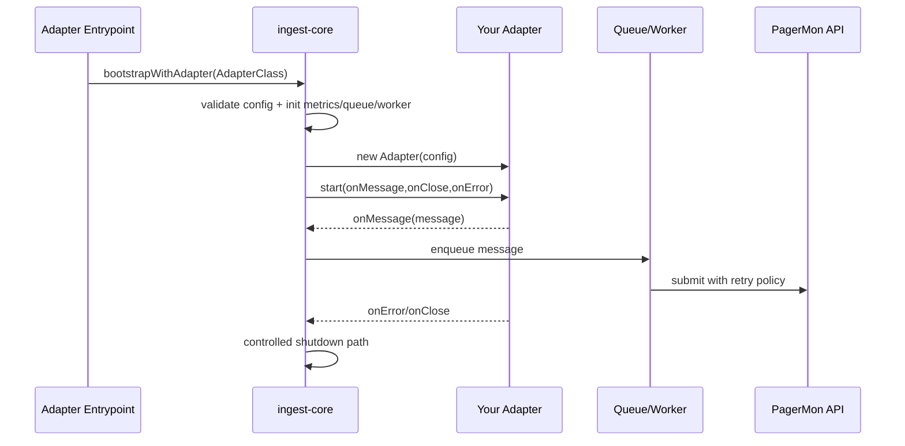

# Adapter Development Guide

This guide is the implementation reference for building a custom PagerMon ingest adapter.

---

## Table of Contents

- [Adapter Development Guide](#adapter-development-guide)
  - [Table of Contents](#table-of-contents)
  - [Adapter/Core Concept](#adaptercore-concept)
    - [Architecture At A Glance](#architecture-at-a-glance)
    - [Runtime Sequence](#runtime-sequence)
    - [Responsibilities: Core vs Adapter](#responsibilities-core-vs-adapter)
    - [Dependency Injection In Practice](#dependency-injection-in-practice)
  - [What You Must Build](#what-you-must-build)
    - [Required Functions You Implement](#required-functions-you-implement)
    - [Required Callbacks You Invoke](#required-callbacks-you-invoke)
    - [Who Calls What and When](#who-calls-what-and-when)
  - [10-Minute Quick Start](#10-minute-quick-start)
  - [Reference Adapter (Complete Example)](#reference-adapter-complete-example)
    - [Adapter Class](#adapter-class)
    - [Entrypoint](#entrypoint)
    - [Environment Example](#environment-example)
  - [Adapter Contract Details](#adapter-contract-details)
    - [`getName()`](#getname)
    - [`start(onMessage, onClose, onError)`](#startonmessage-onclose-onerror)
    - [`stop()`](#stop)
    - [`isRunning()`](#isrunning)
  - [Message Model](#message-model)
  - [Injected Runtime Dependencies](#injected-runtime-dependencies)
    - [Configuration Mapping](#configuration-mapping)
    - [Logging](#logging)
    - [Metrics](#metrics)
  - [Testing Your Adapter](#testing-your-adapter)
    - [Unit Test Pattern](#unit-test-pattern)
    - [Integration Test Pattern](#integration-test-pattern)
  - [Advanced Patterns](#advanced-patterns)
    - [Child Process Adapters](#child-process-adapters)
    - [Long-Lived Stream Adapters](#long-lived-stream-adapters)
    - [Polling with Backoff](#polling-with-backoff)
  - [Repository Layout](#repository-layout)
  - [Deployment](#deployment)
    - [Container (Recommended)](#container-recommended)
    - [Bind Mount Into Core Container](#bind-mount-into-core-container)
    - [Bare Metal](#bare-metal)
  - [Publishing Your Adapter](#publishing-your-adapter)
  - [Configuration Reference](#configuration-reference)
    - [Core Variables](#core-variables)
    - [Adapter Variables](#adapter-variables)
  - [Release Checklist](#release-checklist)
  - [Getting Help](#getting-help)

---

## Adapter/Core Concept

PagerMon ingest is split into two clear parts:

- adapter: your source-specific logic (read, parse, normalize)
- core: shared runtime (config, queue, retries, health, API delivery)

This split keeps source integrations isolated while operational behavior stays consistent across all adapters.

### Architecture At A Glance

1. Your `index.js` calls `bootstrapWithAdapter(YourAdapter)`.
2. Core initializes runtime services (config, queue, worker, API client, health).
3. Core creates adapter instance with injected `config`.
4. Core calls `start(onMessage, onClose, onError)`.
5. Adapter emits normalized messages via callbacks.
6. Core handles buffering, retries, and delivery to PagerMon.

### Runtime Sequence



### Responsibilities: Core vs Adapter

Adapter responsibilities:

- connect to source systems (HTTP, SMTP, SDR, serial, ...)
- parse source payloads
- create valid `Message` objects
- invoke callbacks (`onMessage`, `onError`, `onClose`)
- clean up its own resources in `stop()`

Core responsibilities:

- parse/validate core config (`INGEST_CORE__*`)
- provide runtime dependencies (`logger`, `metrics`, adapter config)
- queue and worker processing (including retries)
- PagerMon API communication
- lifecycle orchestration and health reporting

### Dependency Injection In Practice

Core injects dependencies into your adapter constructor via `config`.

Most relevant injected fields:

- `config.adapter`: structured adapter settings from `INGEST_ADAPTER__*`
- `config.logger`: ready-to-use logger
- `config.metrics`: shared metric registry

Use these injected dependencies instead of creating your own infrastructure layer in the adapter.

---

## What You Must Build

### Required Functions You Implement

Your adapter must export a default class that implements:

- `getName()`
- `start(onMessage, onClose, onError)`
- `stop()`
- `isRunning()`

Without these four methods, the core runtime cannot run your adapter.

### Required Callbacks You Invoke

Inside your `start(...)` flow, you must use core callbacks correctly:

- `onMessage(message)` when you have one valid normalized `Message`
- `onError(error)` for fatal adapter/runtime failures that should stop ingest
- `onClose()` when your source stream has ended and is no longer usable

### Who Calls What and When

1. Your entrypoint calls `bootstrapWithAdapter(YourAdapter)`.
2. Core loads config and creates your adapter instance.
3. Core calls `adapter.start(onMessage, onClose, onError)`.
4. Your adapter reads/parses source data and invokes callbacks.
5. On shutdown, core calls `adapter.stop()`.
6. Core checks `adapter.isRunning()` for status reporting.

Contract boundary:

- You own source integration and callback invocation.
- Core owns runtime lifecycle, queueing, retries, health, and API delivery.

---

## 10-Minute Quick Start

1. Create adapter repo and install core:

```bash
mkdir my-pagermon-adapter
cd my-pagermon-adapter
npm init -y
npm install @pagermon/ingest-core
```

2. Add adapter class at `adapter/my-adapter/adapter.js` (see full reference below).
3. Add `index.js` entrypoint with `bootstrapWithAdapter(...)`.
4. Add `.env` with required core + adapter settings.
5. Run `node index.js`.

Note: for minimal prototypes, adapter class and bootstrap call can live in a single `index.js` file.
For maintainable production adapters, keep them split (`index.js` + `adapter/.../adapter.js`).

---

## Reference Adapter (Complete Example)

This is the canonical implementation example for this document.

### Adapter Class

Create `adapter/my-adapter/adapter.js`:

```javascript
import { Message } from '@pagermon/ingest-core';

class MyAdapter {
  constructor(config = {}) {
    this.config = config;
    this.logger = config.logger;
    this.metrics = config.metrics;
    this.adapterConfig = config.adapter || {};
    this.label = config.label || 'my-adapter';

    if (!this.adapterConfig.apiUrl) {
      throw new Error('INGEST_ADAPTER__API_URL is required');
    }

    this.apiUrl = this.adapterConfig.apiUrl;
    this.pollIntervalMs = Number(this.adapterConfig.pollInterval || 10000);

    this.running = false;
    this.timer = null;
    this.onMessage = null;
    this.onClose = null;
    this.onError = null;

    this.pollDuration = this.metrics.histogram({
      name: 'adapter_poll_duration_seconds',
      help: 'Duration of source poll requests',
      labelNames: ['result'],
      buckets: [0.05, 0.1, 0.25, 0.5, 1, 2, 5],
    });

    this.receivedTotal = this.metrics.counter({
      name: 'adapter_messages_received_total',
      help: 'Total messages received from source',
      labelNames: ['source', 'format'],
    });

    this.upstreamUp = this.metrics.gauge({
      name: 'adapter_upstream_connected',
      help: 'Whether adapter can reach upstream source (1/0)',
    });
  }

  getName() {
    return 'my-adapter';
  }

  start(onMessage, onClose, onError) {
    if (this.running) {
      return;
    }

    if (this.timer) {
      clearInterval(this.timer);
      this.timer = null;
    }

    this.onMessage = onMessage;
    this.onClose = onClose;
    this.onError = onError;
    this.running = true;

    this.logger.info({ apiUrl: this.apiUrl, pollIntervalMs: this.pollIntervalMs }, 'Adapter started');

    this.pollOnce();
    this.timer = setInterval(() => this.pollOnce(), this.pollIntervalMs);
  }

  async pollOnce() {
    if (!this.running) return;

    const end = this.pollDuration.startTimer({ result: 'success' });

    try {
      const response = await fetch(this.apiUrl);
      if (!response.ok) {
        throw new Error(`HTTP ${response.status}`);
      }

      const payload = await response.json();
      this.upstreamUp.set(1);

      let invalidItems = 0;

      for (const item of payload.messages || []) {
        const msg = new Message({
          address: String(item.address || ''),
          message: String(item.message || ''),
          format: item.format === 'numeric' ? 'numeric' : 'alpha',
          metadata: { source: this.label },
        });

        const result = msg.validate();
        if (!result.valid) {
          invalidItems += 1;
          this.logger.warn({ errors: result.errors, item }, 'Skipping invalid upstream item');
          continue;
        }

        this.receivedTotal.inc({ source: this.label, format: msg.format });
        this.onMessage(msg);
      }

      if (invalidItems > 0) {
        this.logger.warn({ invalidItems }, 'Some upstream items were skipped due to validation errors');
      }

      end({ result: 'success' });
    } catch (err) {
      this.upstreamUp.set(0);
      end({ result: 'failure' });
      this.onError(err);
    }
  }

  stop() {
    this.running = false;

    if (this.timer) {
      clearInterval(this.timer);
      this.timer = null;
    }

    this.logger.info('Adapter stopped');
  }

  isRunning() {
    return this.running;
  }
}

export default MyAdapter;
```

### Entrypoint

Create `index.js`:

```javascript
import { bootstrapWithAdapter } from '@pagermon/ingest-core';
import MyAdapter from './adapter/my-adapter/adapter.js';

bootstrapWithAdapter(MyAdapter);
```

### Environment Example

Create `.env.example`:

```bash
# Required core settings
INGEST_CORE__API_URL=http://pagermon:3000
INGEST_CORE__API_KEY=replace_me

# Optional core settings
INGEST_CORE__LABEL=my-adapter
INGEST_CORE__REDIS_URL=redis://redis:6379
INGEST_CORE__METRICS_ENABLED=true

# Adapter settings
INGEST_ADAPTER__API_URL=https://example.org/messages
INGEST_ADAPTER__POLL_INTERVAL=10000
```

Run locally:

```bash
cp .env.example .env
node index.js
```

---

## Adapter Contract Details

| Function                             | Implemented by | Called by | Must do                                     |
| ------------------------------------ | -------------- | --------- | ------------------------------------------- |
| `getName()`                          | You            | Core      | Return stable adapter identifier            |
| `start(onMessage, onClose, onError)` | You            | Core      | Start source processing and store callbacks |
| `stop()`                             | You            | Core      | Release all resources                       |
| `isRunning()`                        | You            | Core      | Return current running state                |

### `getName()`

Return a stable identifier that does not change across runs. This value is used for logs and diagnostics.

### `start(onMessage, onClose, onError)`

Called exactly by core to begin ingestion.

`start(...)` may be synchronous or async. Core awaits it.

You must:

- persist callbacks for async operations
- open connections/start polling/spawn processes
- call `onMessage(...)` for each valid message
- call `onError(...)` for fatal adapter/runtime errors
- call `onClose()` if source stream has ended and ingest should stop

Important runtime behavior:

- `onError()` is currently treated by core as fatal and triggers service shutdown
- `onClose()` is currently treated by core as fatal and triggers service shutdown

That means transient conditions should normally be handled inside the adapter itself where possible, for example by retrying, reconnecting, or skipping invalid upstream items without calling `onError()`.

### `stop()`

Called by core during shutdown.

You must clean up everything you created in `start(...)`:

- timers
- sockets/streams
- child processes
- event listeners

### `isRunning()`

Return an accurate runtime state. Avoid deriving this lazily from external systems.

---

## Message Model

Always emit `Message` instances:

```javascript
import { Message } from '@pagermon/ingest-core';
```

Required fields:

- `address` (string)
- `message` (string, optional)
- `format` (`alpha` or `numeric`, optional)
- `source` (string, optional)

`format` is a normalized PagerMon message class, not the radio/decoder protocol.

- use `alpha` for alphanumeric/text pager messages
- use `numeric` for numeric pager messages
- keep protocol-specific information such as `POCSAG1200`, `POCSAG2400`, or `FLEX` in `metadata`

Core format resolution order:

1. `format` parameter (if provided)
2. `metadata.format` (if provided)
3. fallback inference: `alpha` if `message` is non-empty, otherwise `numeric`

Use explicit `format` or `metadata.format` when your adapter can determine the semantic message type from protocol context.

Optional fields:

- `timestamp` (unix timestamp in seconds)
- `time` (ISO8601 timestamp)
- `metadata` (object with adapter/protocol-specific data)

Constructor behavior:

- `timestamp` defaults to current unix timestamp if omitted
- `time` defaults to an ISO string derived from `timestamp`
- `metadata` defaults to `{}`
- `format` is normalized to lowercase

Payload behavior:

- `message.toPayload()` returns the normalized message fields
- `metadata` is flattened into the final API payload

Source behavior:

- adapters provide source only via `metadata.source`
- if `metadata.source` is empty or missing, core defaults source to `INGEST_CORE__LABEL`
- no top-level `source` input field is used for source resolution

For `alpha`, provide non-empty `message`.

Message field reference:

| Field       | Required | Type     | Notes                                                         |
| ----------- | -------- | -------- | ------------------------------------------------------------- |
| `address`   | yes      | `string` | receiver/capcode                                              |
| `message`   | no       | `string` | required only if resolved format is `alpha`                   |
| `format`    | no       | `string` | resolved from `format`/`metadata.format`/fallback inference   |
| `timestamp` | no       | `number` | unix timestamp in seconds                                     |
| `time`      | no       | `string` | ISO8601 timestamp                                             |
| `metadata`  | no       | `object` | protocol-specific fields; includes optional `metadata.source` |

Validate before emit when your parser receives untrusted input:

```javascript
const result = msg.validate();
if (!result.valid) {
  onError(new Error(result.errors.join(', ')));
  return;
}
onMessage(msg);
```

---

## Injected Runtime Dependencies

Core injects dependencies via adapter constructor `config`.

Injected adapter config shape:

- `config.label`: ingest label from `INGEST_CORE__LABEL`
- `config.adapter`: structured adapter settings from `INGEST_ADAPTER__*`
- `config.rawEnv`: raw adapter env map with original key names
- `config.logger`: logger instance scoped for adapter usage
- `config.metrics`: shared metrics registry instance

### Configuration Mapping

Adapter env keys are mapped to `config.adapter`:

```bash
INGEST_ADAPTER__API_URL=https://example.org
INGEST_ADAPTER__SMTP__HOST=smtp.example.org
```

becomes:

- `config.adapter.apiUrl`
- `config.adapter.smtp.host`

Use `config.rawEnv` only for debugging or edge fallback behavior.

Core defaults relevant during local development:

- `INGEST_CORE__API_URL` defaults to `http://pagermon:3000`
- `INGEST_CORE__REDIS_URL` defaults to `redis://redis:6379`
- `INGEST_CORE__LABEL` defaults to `pagermon-ingest`

Core requires:

- `INGEST_CORE__API_KEY`

### Logging

Use injected logger from `config.logger`.

If the adapter class exposes a static `adapterName` string, core uses that as logger namespace fallback during adapter creation; otherwise it uses the class name.

Recommended levels:

- `info` lifecycle/start/stop
- `debug` verbose parser internals
- `warn` recoverable anomalies
- `error` hard failures

Create scoped loggers for subcomponents:

```javascript
this.decoderLogger = this.logger.child({ component: 'decoder' });
```

### Metrics

Use injected metrics from `config.metrics`:

- `counter({...})`
- `gauge({...})`
- `histogram({...})`

Rules:

- define metric names without global prefix
- register metrics once (usually in constructor)
- prefer stable names + labels for dimensions
- no dynamic metric names
- metric registration is idempotent per metric name within the shared registry
- metrics object is available even when metrics HTTP endpoint is disabled
- `INGEST_CORE__METRICS_ENABLED` controls HTTP exposure, not whether you can register metrics

Example names:

- `adapter_messages_received_total`
- `adapter_poll_duration_seconds`
- `adapter_upstream_connected`

Core runtime metrics exist alongside your adapter metrics. Your custom metrics share the same registry and prefix.

---

## Testing Your Adapter

### Unit Test Pattern

```javascript
import { describe, expect, it, vi } from 'vitest';
import MyAdapter from '../../adapter/my-adapter/adapter.js';
import { createMockLogger, createMockMetrics } from '@pagermon/ingest-core/testing';

describe('MyAdapter', () => {
  it('validates required config', () => {
    expect(() => {
      new MyAdapter({
        logger: createMockLogger(vi),
        metrics: createMockMetrics(),
        adapter: {},
      });
    }).toThrow('INGEST_ADAPTER__API_URL is required');
  });

  it('emits messages via onMessage callback', async () => {
    const adapter = new MyAdapter({
      logger: createMockLogger(vi),
      metrics: createMockMetrics(),
      adapter: { apiUrl: 'http://localhost:9999/messages', pollInterval: 50 },
    });

    const onMessage = vi.fn();
    const onClose = vi.fn();
    const onError = vi.fn();

    adapter.start(onMessage, onClose, onError);

    await new Promise((resolve) => setTimeout(resolve, 120));

    adapter.stop();

    expect(typeof adapter.isRunning()).toBe('boolean');
  });
});
```

Notes:

- use `createMockLogger(vi)` for spy-capable logger assertions
- use `createMockMetrics()` to assert registration and metric updates

### Integration Test Pattern

Integration tests should run against real dependencies when possible:

- real source endpoint or test fixture server
- real Redis
- test PagerMon API endpoint

Keep one smoke test that verifies end-to-end callback flow and graceful shutdown.

---

## Advanced Patterns

### Child Process Adapters

If your adapter spawns external decoders/tools:

- capture stdout/stderr explicitly
- map parser errors to adapter-level handling
- ensure `stop()` terminates child processes and clears listeners
- treat zombie-process prevention as a release criterion

### Long-Lived Stream Adapters

For TCP/WebSocket/serial streams:

- persist connection handles on `this`
- centralize reconnect/backoff logic in adapter code
- emit `onMessage` only for validated messages
- avoid calling `onError` for transient transport blips unless shutdown is intended

### Polling with Backoff

For HTTP/file polling adapters:

- use base interval + capped exponential backoff on repeated failures
- reset backoff after a successful poll
- record backoff state in metrics for observability

---

---

## Repository Layout

Recommended adapter repository structure:

```text
my-pagermon-adapter/
├── adapter/
│   └── my-adapter/
│       ├── adapter.js
│       ├── parser.js
│       └── client.js
├── test/
│   ├── unit/
│   │   └── adapter.test.js
│   └── integration/
│       └── e2e.test.js
├── .env.example
├── compose.yml
├── Dockerfile
├── index.js
├── package.json
└── README.md
```

---

## Deployment

### Container (Recommended)

Use this as default production option:

```dockerfile
FROM node:24-slim

WORKDIR /app

COPY package*.json ./
RUN npm ci --omit=dev

COPY . .
CMD ["node", "index.js"]
```

Build and run:

```bash
docker build -t my-org/pagermon-adapter:latest .
docker run -d --name pagermon-ingest --env-file .env my-org/pagermon-adapter:latest
```

### Bind Mount Into Core Container

For fast local iteration, you can mount your adapter code into a core container instead of building a custom image.

Concept:

- run core image
- mount local adapter directory to `/app/adapter`
- set adapter entry to `/app/adapter/adapter.js`

Example:

```bash
docker run -d \
  --name pagermon-ingest-core \
  --env-file .env \
  -e INGEST_CORE__ADAPTER_ENTRY=/app/adapter/adapter.js \
  -v "$(pwd)/adapter/my-adapter:/app/adapter:ro" \
  ghcr.io/eopo/pagermon-ingest-core:latest
```

Use this primarily for development/debugging. For production, prefer a dedicated image so code and dependencies are versioned together.

### Bare Metal

For local development:

```bash
npm install
cp .env.example .env
npm start
```

Requirements:

- Node.js >= 22
- reachable Redis
- reachable PagerMon server

---

## Publishing Your Adapter

Recommended release artifacts:

- versioned container image (primary)
- optional npm package (if intended for extension/reuse)

Minimum publish checklist:

- image starts with valid env only
- adapter contract methods verified in CI
- unit + at least one integration smoke test green
- README includes required adapter env variables and defaults
- changelog/release notes document behavior changes

---

## Configuration Reference

Core settings (`INGEST_CORE__*`) are parsed and validated by ingest-core.

### Core Variables

| Variable                                  | Required | Default                   | Description                                                                    |
| ----------------------------------------- | -------- | ------------------------- | ------------------------------------------------------------------------------ |
| `INGEST_CORE__API_URL`                    | no       | `http://pagermon:3000`    | PagerMon API base URL used by ingest worker; defaults when variable is not set |
| `INGEST_CORE__API_KEY`                    | yes      | none                      | API key for authenticated message submission                                   |
| `INGEST_CORE__LABEL`                      | no       | `pagermon-ingest`         | Default message source label when adapter omits `metadata.source`              |
| `INGEST_CORE__REDIS_URL`                  | no       | `redis://redis:6379`      | Redis connection string for queue storage                                      |
| `INGEST_CORE__ENABLE_DLQ`                 | no       | `true`                    | Enables dead-letter queue for permanently failed jobs                          |
| `INGEST_CORE__HEALTH_CHECK_INTERVAL`      | no       | `10000`                   | Interval in ms for PagerMon health checks                                      |
| `INGEST_CORE__HEALTH_UNHEALTHY_THRESHOLD` | no       | `3`                       | Failed health checks before service is marked unhealthy                        |
| `INGEST_CORE__ADAPTER_ENTRY`              | no       | `/app/adapter/adapter.js` | Adapter module path used in loader mode                                        |
| `INGEST_CORE__METRICS_ENABLED`            | no       | `false`                   | Expose metrics endpoint over HTTP                                              |
| `INGEST_CORE__METRICS_PORT`               | no       | `9464`                    | Metrics HTTP port                                                              |
| `INGEST_CORE__METRICS_HOST`               | no       | `0.0.0.0`                 | Metrics bind host                                                              |
| `INGEST_CORE__METRICS_PATH`               | no       | `/metrics`                | Metrics endpoint path                                                          |
| `INGEST_CORE__METRICS_PREFIX`             | no       | `pagermon_ingest_`        | Prefix prepended to all exported metric names                                  |
| `INGEST_CORE__METRICS_COLLECT_DEFAULT`    | no       | `true`                    | Collect default Node.js process metrics                                        |
| `INGEST_CORE__METRICS_DEFAULT_LABELS`     | no       | empty                     | Comma-separated labels (`key=value,key2=value2`) parsed by core                |

### Adapter Variables

Adapter variables use the `INGEST_ADAPTER__*` prefix and are passed to adapters in two forms:

- `config.adapter`: structured object (nested keys supported)
- `config.rawEnv`: raw key/value map

Mapping examples:

```bash
INGEST_ADAPTER__API_URL=https://example.org
INGEST_ADAPTER__SMTP__HOST=smtp.example.org
INGEST_ADAPTER__SMTP__PORT=587
```

becomes:

- `config.adapter.apiUrl`
- `config.adapter.smtp.host`
- `config.adapter.smtp.port`

Adapter variables are adapter-specific by design:

- define required/optional keys in your adapter README
- validate required adapter keys early (constructor/startup)
- provide defaults for optional adapter keys where possible

---

## Release Checklist

Before publishing your adapter:

- contract methods implemented and tested
- callbacks used correctly (`onMessage`, `onError`, `onClose`)
- graceful `stop()` cleanup verified
- `.env.example` complete
- unit tests passing
- one integration smoke test passing
- image/build tested in target runtime

---

## Getting Help

- Core issues: https://github.com/eopo/pagermon-ingest-core/issues
- Include in your issue:
  - adapter type/source
  - deployment mode (container or bare metal)
  - relevant logs
  - redacted configuration
